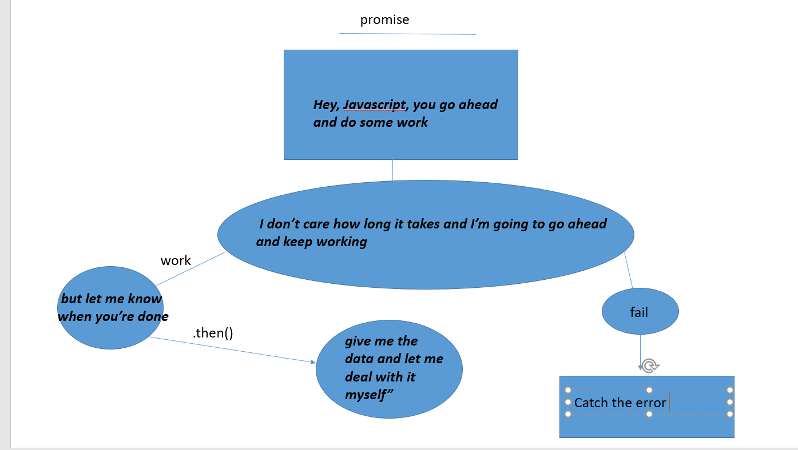

#  Linked List
A Linked List is a sequence of Nodes that are connected/linked to each other. The most defining feature of a Linked List is that each Node references the next Node in the link

Linked List two types of Linked List:

 Singly and Doubly

## terminology:
1- Linked List - A data structure that contains nodes that links/points to the next node in the list.

2. Singly - Singly refers to the number of references the node has. A Singly linked list means that there is only one reference, and the reference points to the Next node in a linked list.
3. Doubly - Doubly refers to there being two (double) references within the node. A Doubly linked list means that there is a reference to both the Next and Previous node.

## Traversal

When traversing a linked list, you are not able to use a foreach or for loop. We depend on the Next value in each node to guide us where the next reference is pointing. The Next property is exceptionally important because it will lead us where the next node is and allow us to extract the data appropriately.

## Big O

Order of operations is extremely important when it comes to working with a Linked List. What I mean by this is you must be careful that all references to each link/node is properly assigned.

An example can be with adding a node to a linked list. If we want to add a node with an O(1) efficiency, we have to replace the current Head of the linked list with the new node, without losing the reference to the next node in the list.

### steps to add a new node with an O(1) efficiency.

- Set Current equal to Head. This will guarantee us that we are - 

- starting from the very beginning.

- We can then instantiate the new node that we are adding. The  values passed in as arguments into the Add() method will define what the value of the Node will be.

## Adding a Node O(n)

Adding a node to the middle of a linked list is a bit different than adding to the beginning. This is because we are working with more nodes and must re-allocate to make room for the new node.

1- Let’s start out with a basic Singly Linked List:

- Now let’s create a new node (node6). We will set the value of node6 to be 16. The Next will be null because we haven’t yet attached it into the linked list.

- Now let’s start the adding. We can do an AddBefore method or an `AddAfter`. For this documentation, we will do an` AddBefore.` The `AddAfter `is extremely similar…see if you can figure it out on your own!

## Linear data structures

- If we really want to understand the basics of linked lists, it’s important that we talk about what type of data structure they are.
One characteristic of linked lists is that they are linear data structures, which means that there is a sequence and an order to how they are constructed and traversed. We can think of a linear data structure like a game of hopscotch: in order to get to the end of the list, we have to go through all of the items in the list in order, or sequentially. Linear structures, however, are the opposite of non-linear structures. In non-linear data structures, items don’t have to be arranged in order, which means that we could traverse the data structure non-sequentially.

Similarly, when we use arrays in our code, we’re implementing a linear data structure! It can be helpful to think of arrays and linked lists as being similar in the way that we sequence data

## Memory management

The biggest differentiator between arrays and linked lists is the way that they use memory in our machines. 

Those of us who work with dynamically typed languages like Ruby, JavaScript, or Python don’t have to think about how much memory an array uses when we write our code on a day to day basis because there are several layers of abstraction that end up with us not having to worry about memory allocation at all.

## Parts of a linked list
A linked list can be small or huge, but no matter the size, the parts that make it up are actually fairly simple. A linked list is made up of a series of nodes, which are the elements of the list.

## Lists for all shapes and sizes
Even though the parts of a linked list don’t change, the way that we structure our linked lists can be quite different. Like most things in software, depending on the problem that we’re trying to solve, one type of linked lists might be a better tool for the job than another.

## A circular linked list

is a little odd in that it doesn’t end with a node pointing to a null value. Instead, it has a node that acts as the tail of the list (rather than the conventional head node), and the node after the tail node is the beginning of the list. 

This organization structure makes it really easy to add something to the end of the list, because you can begin traversing it at the tail node, as the first element and last element point to one another. Circular linked lists can start to get really crazy because we can turn both a singly linked list and a doubly linked list into a circular linked list!

## Growing a linked list

The same goes for Big O Notation, but on a much lower level. Big O Notation is a way of evaluating the performance of an algorithm.

We already know what linked lists are made of, and how their non-contiguous memory allocation makes them uniquely different from their seemingly more popular cousin, the array.

So how do they work, exactly? Well, just like with an array, we can add elements and remove elements from a linked list. But unlike arrays, we don’t need to allocate memory in advance or copy and re-create our linked list, since we won’t “run out of space” the way we might with a pre-allocated array.

- But inserting an element at the end of a linked list is a different story. The interesting thing here is that the steps you take to actually do the inserting are the exact same:
Find the node we want to change the pointer of (in this case, the last node)

- Create the new node we want to insert and set its pointer (in this case, to null).

- Direct the preceding node’s pointer to our new node

## To list or not to list?
No human is perfect, and neither is a linked list. Here’s the thing: sometimes, a linked list can be really awesome — for example, 

when you want to insert or remove something at the beginning of the list. But, as we’ve learned, they can sometimes be…less than ideal (imagine having a million nodes and just wanting to delete the last one!)